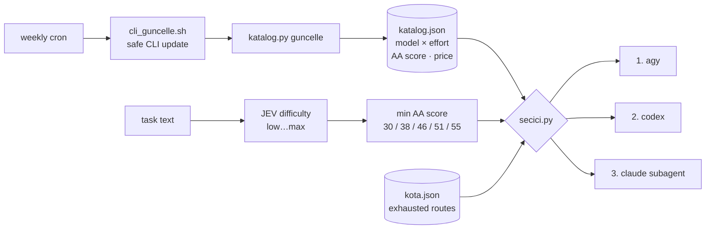

# jev-subagent-router

**Stop hand-picking which AI does the job.** A small router that sends every delegated task to the
cheapest model that is smart enough for it, across three CLI routes, and keeps its own model list
fresh every week.

```
$ python3 secici.py "find the root cause of the look-ahead bug in the engine"
zorluk high (min AA 46)
  1. agy    Claude Sonnet 5.5 (High)     AA  46.8  ->  agy --print "<prompt>" --model claude-sonnet-5-5-high
  2. codex  GPT 6.1 Sol (medium)         AA  47.8  ->  codex exec -m gpt-6.1-sol -c model_reasoning_effort=medium "<prompt>"
  3. claude Claude Sonnet 5.5 (high)     AA  46.8  ->  Agent(model="sonnet")  # effort high
```

Try #1. If its quota is gone, mark it and fall through to #2, then #3.

## Why

Agent setups usually burn their most expensive model on everything, including "summarize these
three logs". Meanwhile free and subscription routes (Antigravity `agy`, OpenAI `codex`) sit idle,
and new models land every few weeks without anyone updating the routing table.

This project fixes three things:

1. **Difficulty decides the bar, not habit.** A classifier (JEV) rates the task `low … max`, which maps
   to a minimum [Artificial Analysis](https://artificialanalysis.ai) intelligence score.
2. **Free first, cheap second, smart enough always.** Routes are tried `agy → codex → claude`. Inside a
   route the winner is the cheapest model, then the lowest reasoning effort, then the smartest.
3. **The catalog maintains itself.** A weekly job updates the CLIs (without touching their config),
   re-lists every model + reasoning level they offer, and re-scores them.

## How it works



| Difficulty | Min AA score | Typical pick |
|---|---|---|
| low | 30 | Gemini Flash (agy) |
| medium | 38 | Gemini 3.8 Flash Medium → GPT-6 Luna → Sonnet medium |
| high | 46 | Sonnet High (agy) → GPT-6.1 Sol medium → Sonnet high |
| xhigh | 51 | Opus Medium (agy) → GPT-6.1 Sol xhigh → Sonnet xhigh |
| max | 55 | strongest open model |

## Components

| File | What it does |
|---|---|
| `katalog.py` | Builds `katalog.json`: every model and reasoning level from `agy models`, `codex debug models`, and the newest Claude Sonnet/Opus. Adds AA intelligence score and OpenRouter price (used as relative cost, since the CLIs bill quota, not dollars). **Refuses to write** if under half the models match AA or a route is missing, so a broken run never replaces a good catalog. |
| `secici.py` | Task → fallback chain with ready-to-run commands. `--kota-bitti <route> [hours]` skips a route until its quota resets (default 5h). `--json` for scripts. |
| `ajan_kapisi.py` | Claude Code `PreToolUse` hook on `Agent`: a subagent is **denied** unless `secici.py` ran in the last 15 minutes. Every call is logged; `--rapor` shows how many went through the router. Fails open when its log is broken. |
| `cli_guncelle.sh` | Runs each CLI's own `update`. Backs up the config files first and **restores any config the update changed**. Logs a broken binary loudly. |
| `haftalik.sh` | Weekly pipeline: CLI update → catalog → commit and push `katalog.json`. |

## Setup

Requirements: Python 3.10+, the `agy`, `codex` and `claude` CLIs, an Artificial Analysis API key, and
the JEV classifier (`/root/scripts/jev.py`, `jev_efor.py`). Without JEV every task is treated as `medium`.

```bash
python3 katalog.py guncelle          # build the catalog
python3 katalog.py goster            # inspect it
python3 secici.py "your task"        # get a chain
```

Weekly cron (Sunday 04:30), under `flock` so runs never overlap:

```cron
30 4 * * 0 flock -n /tmp/alt_ajan_haftalik.lock /path/to/haftalik.sh
```

Gate hook in `~/.claude/settings.json`:

```json
{"hooks": {"PreToolUse": [{"matcher": "Agent",
  "hooks": [{"type": "command", "command": "python3 /path/to/ajan_kapisi.py", "timeout": 10}]}]}}
```

## Tests

No network, no money:

```bash
python3 katalog.py --demo
python3 secici.py --demo
python3 ajan_kapisi.py --demo
```

## Known limits

- AA scores are a general intelligence index, not a benchmark of *your* tasks. Treat them as a
  pre-filter.
- The CLI updater restores config but cannot roll back a broken binary.
- Price is per token. Higher effort levels think longer, so true cost per task is only known by
  measuring.
- Paths are set up for the author's server (`/root/...`). Adjust the constants at the top of each file.
